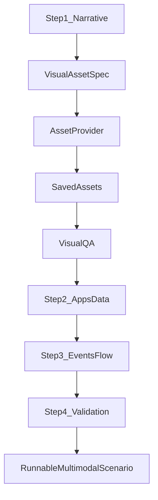

# MVP Design: Multimodal Scenario Generator

## Goal
Extend the existing text-only PARE scenario generator into a multimodal generator that can create visual scenario descriptions, attach or create image assets, and generate runnable multimodal scenarios with image-grounding validation.

The long-term MVP target is a generator that follows this flow:

## Recommended Direction
Use a hybrid asset-provider design:

- Start with local/user-provided image assets as the reliable baseline.
- Add automatic image generation as an optional provider for photo-like assets.
- Use deterministic rendering for text-heavy screenshots/documents where exact text matters.

This keeps benchmark scenarios reproducible while still allowing the generator to create new visual tasks when the image requirements are simple enough.

## OpenAI Model Roles
- Use `gpt-5` or `gpt-5-mini` for text/code work: scenario descriptions, `VisualAssetSpec` JSON, image prompts, deterministic-rendering instructions, scenario Python code, and validation logic.
- Use OpenAI `gpt-image-2` for actual image asset generation through the Images API. In the current repo, `gpt-5` / `gpt-5-mini` do not directly create image files.
- Use a vision-capable judge model, ideally `gpt-5` or the same observe-model family used in experiments, for visual QA.
- Store the generated image file, prompt, model identifier/snapshot, provider metadata, and QA verdict in the asset manifest for reproducibility.

## Asset Strategy Options

### Option A: User-Provided / Local Asset Library
The generator chooses images from a curated local asset library, copies them into the generated scenario's asset directory, and writes scenario code around a saved manifest.

Pros:
- Highest reliability for benchmark scenarios because the image content is known before scenario generation.
- Best reproducibility: assets can be versioned externally, checksummed, and reused across runs.
- Works well for bills, screenshots, posters, handwritten notes, UI captures, and documents with exact dates/prices/text.
- Easier validation because the manifest can encode ground truth for each asset.
- Lower external dependency risk; no image-generation API, model drift, safety filter, or provider latency needed.

Cons:
- Requires someone to collect or create enough images before generation.
- Scenario diversity is bounded by the asset library.
- Asset curation becomes its own workflow: labeling, licensing/privacy review, ground-truth metadata, and storage.
- It cannot invent a missing image on demand unless a suitable fixture already exists.

### Option B: Automatic Image Generation
The generator first creates a scenario description, extracts a `VisualAssetSpec`, calls an image-generation or deterministic-rendering backend, stores the image, then runs visual QA before writing scenario code.

Pros:
- Can create new visual scenarios from text descriptions without manually collecting every image first.
- Good for common photo-like scenes where exact text is not central, such as a rice cooker photo, bird photo, damaged package, plant disease photo, or product snapshot.
- Enables richer generation loops: narrative -> asset spec -> generated image -> QA -> scenario code.
- Reduces manual asset-library setup for exploratory benchmark expansion.

Cons:
- Generated image content is not guaranteed; the image may miss the key object, add distractors, or fail to match intended ground truth.
- Text-heavy images are risky. Bills, screenshots, posters, whiteboards, receipts, dates, phone numbers, prices, and account details can be wrong or unreadable.
- Reproducibility requires saving the exact generated image and metadata; regenerating from the same prompt may not yield the same result.
- Requires QA and retry loops, likely using a VLM.
- External image-generation APIs introduce cost, latency, provider/model drift, and possible content-policy failures.

## Core Components
- Add multimodal prompt rules to `pare/scenarios/generator/prompt/scenario_generating_agent_prompts.py`.
- Extend app inventory and prompt context in `pare/scenarios/generator/utils/apps_init_instructions.py` and `pare/scenarios/generator/scenario_generator.py` to include `StatefulAlbumApp`, `SandboxLocalFileSystem`, Email image attachments, `Files.display`, and Album `view_photo`.
- Add an asset-planning phase after Step 1 in `pare/scenarios/generator/agent/scenario_generating_agent_orchestrator.py`.
- Add an `AssetProvider` abstraction:
  - `LocalAssetProvider`: selects/copies user-provided images from a fixture library.
  - `OpenAIImageAssetProvider`: calls OpenAI `gpt-image-2` for photo-like assets.
- Add deterministic renderers for text-heavy images like bills, receipts, posters, screenshots, and whiteboards.
- Add visual QA to confirm that each asset satisfies its manifest before scenario code is generated.

## Scenario Code Pattern
Generated scenarios should follow the existing multimodal benchmark examples in `pare/scenarios/multimodal_benchmark/`.

For email-based scenarios:
- Seed `SandboxLocalFileSystem`.
- Attach image assets with `StatefulEmailApp.send_email_to_user_with_id(...)`.
- Let the agent observe via `StatefulEmailApp.get_email_by_id(...)` and/or `Files.display(...)`.

For album-based scenarios:
- Seed `SandboxLocalFileSystem`.
- Add photo metadata through `StatefulAlbumApp`.
- Let the agent narrow candidates with `list_photos(...)` / metadata search.
- Let the agent inspect pixels with `view_photo(...)`.

Validation should check both final side effects and image inspection, using helper logic equivalent to `log_has_agent_image_view`.

## Limitations
- Generated images are not guaranteed to contain exact requested details, especially text, numbers, prices, dates, small UI labels, and handwriting.
- Scenario quality depends on asset QA. A scenario is benchmark-valid only if the image actually supports the intended inference.
- Vision-model performance is not guaranteed; a weaker observe model may fail even when the image is correct.
- More candidate images mean more tool calls and higher multimodal token cost.
- Text-heavy image generation should use deterministic rendering, not free-form image generation.

## Milestone Split
- M1: Local-asset multimodal generator with prompt changes, asset manifest/provider, lightweight visual QA, and reference-based scenario generation.
- M2: Optional `gpt-image-2` asset provider for photo-like images and regenerate-on-QA-failure loops.
- M3: Deterministic renderers for text-heavy documents/screenshots and richer multi-image search tasks.
